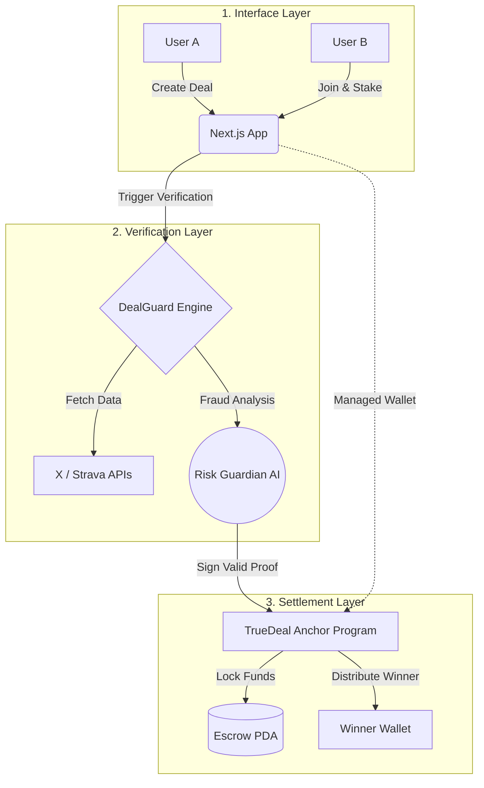

<div align="center">


# True Deal


**Gamify your personal goals and achievements with friends who share the same desires.**  
*"Don't trust. Make a True Deal."*

[](https://www.colosseum.org/)

[🇧🇷 Clique aqui para ler a documentação completa em Português](#-versão-em-português-documentação-completa)

</div>

---

## 🇬🇧 English Version

### 🎯 Mission
**True Deal** is a Sovereign Performance Agreement Protocol. We help you gamify personal goals with friends by turning social wagers into verifiable, on-chain contracts. No more arguments over who won—you stake real USDC, the app verifies the results automatically, and Solana distributes the pot trustlessly.

### 🏗️ Sovereign Architecture



For full local setup instructions, env variables, roadmap, and competitor analysis, please refer to the detailed Portuguese section below.

---

## 🇧🇷 Versão em Português (Documentação Completa)

---

## 🎯 A Tese (Mission)

O **TrueDeal** é um Protocolo Soberano de Acordos de Performance. Nós resolvemos o problema da quebra de confiança em interações sociais financeiras (Social Wagers). 

Em vez de depender da boa-fé para o cumprimento de desafios pessoais, esportivos ou metas de engajamento, o TrueDeal atua como um **Árbitro Digital Trustless**, utilizando Oráculos de IA para verificar dados do mundo real e Smart Contracts na Solana para liquidar pagamentos instantaneamente.

---

## ❌ O Problema (The Problem)

O mercado global de apostas sociais e compromissos peer-to-peer (P2P) movimenta bilhões de forma invisível, mas sofre de três falhas estruturais críticas:

1. **Fricção de Liquidação:** A resolução não é automática. O perdedor frequentemente atrasa o pagamento ou desiste do acordo, gerando atrito social.
2. **Assimetria de Informação:** Não existe prova objetiva e incontestável do início (snapshot) e do fim (conclusão) da meta estabelecida.
3. **Ausência de Custódia Neutra:** Requer confiança mútua absoluta, limitando o tamanho do capital em risco (stake) e o número de participantes.

---

## 💡 A Solução (The Solution)

O TrueDeal transforma promessas sociais em **Infraestrutura Executável**:

| Etapa Operacional | Tecnologia & Execução |
|-------------------|-----------------------|
| **Criação (Deal)** | O usuário configura as regras do contrato: fonte de dados (X, Strava), meta, prazo e montante financeiro. |
| **Garantia (Stake)** | Os participantes depositam o valor estipulado no *Sovereign Escrow* via USDC ou SOL. O capital fica criptograficamente travado. |
| **Snapshot Inicial** | O sistema registra o estado zero inalterável (ex: número exato de seguidores) no momento do aceite. |
| **Auditoria Forense** | O **DealGuard Oracle** (alimentado pelo *Risk Guardian AI*) consome as APIs e busca anomalias em tempo real. |
| **Liquidação (Settlement)** | O veredito é processado on-chain. O programa Solana distribui o capital para o vencedor sem intermediários. |

---

## 🏗️ Arquitetura Soberana (3-Layer Model)

O protocolo foi desenhado sob o paradigma de separação de responsabilidades, garantindo segurança institucional e baixa latência:

### 1. Camada de Inteligência de Risco (Risk Guardian AI)
Um motor de inteligência artificial edge (Edge AI) focado em integridade. Ele monitora a evolução do acordo para detectar anomalias estatísticas, uso de bots (ex: compra de seguidores) e falsificação de localização (GPS spoofing).

### 2. Camada de Atestação (DealGuard Oracle)
Motor de consenso que consome dados Web2 (X API, Strava) e gera provas criptográficas formatadas (Hashes de 32 bytes). O oráculo atua como a única fonte de verdade aceita pelo Smart Contract.

### 3. Camada de Liquidação On-Chain (Solana Anchor)
O coração trust-less do protocolo. Um programa em Rust na Solana que gerencia PDAs (Program Derived Addresses) blindados. Os fundos só são liberados perante a assinatura válida do *DealGuard Oracle*, garantindo liquidação em ~400ms.

---

## 🛠️ Stack Técnica

| Camada | Tecnologia |
|--------|------------|
| **Frontend** | Next.js 15 (App Router), React 19, TypeScript, Tailwind CSS v4 |
| **Backend / Orchestrator** | Supabase (Postgres, Auth, Edge Functions) |
| **Blockchain** | **Solana** — Anchor framework (Rust), Escrow PDAs |
| **Risk Layer** | **Risk Guardian** (AI-driven monitoring) |
| **Verification Layer** | **DealGuard Engine** (Consensus Attestation) |
| **Managed Wallet** | Solana Account Abstraction (Encrypted server-side keys) |


### Programa Solana (Anchor)

O coração on-chain do True Deal é um programa Anchor que:

- Cria uma **conta PDA** (Program Derived Address) como escrow para cada deal
- Aceita stake em **USDC (SPL Token)** ou **SOL nativo**
- Recebe a resolução do oracle (backend verificador) e distribui o pot automaticamente
- Suporta 3 modos de distribuição: Proporcional · Top-3 Ranking · Winner Takes All
- Taxa de plataforma descontada on-chain (Regular 5% · Super 1%)

```
Fluxo on-chain:

[Usuário] --stake--> [PDA Escrow] --resolução (oracle)--> [Distribuição automática]
                         |
                    [Programa TrueDeal]
                    (Anchor / Rust · Solana Devnet)
```

### Configuração Solana

```bash
# Instalar Solana CLI
sh -c "$(curl -sSfL https://release.anza.xyz/stable/install)"

# Instalar Anchor CLI
cargo install --git https://github.com/coral-xyz/anchor avm --force
avm install latest && avm use latest

# Configurar rede (Devnet para desenvolvimento)
solana config set --url devnet
solana-keygen new --outfile ~/.config/solana/id.json
solana airdrop 2  # SOL de teste no Devnet

# Build e deploy do programa
cd contracts/
anchor build
anchor deploy --provider.cluster devnet
```

**Program ID (Devnet):** `9zfQ1dwJ9Po7YCPWJ3S13ic3nxZcA9cEwBVsXdKub1c4`

**TDP Reputation Token (Devnet):**
| Campo | Valor |
|-------|-------|
| Mint Address | `3hwgvhV1PBj1N3vrRijqjFmJJLXM7Q2VvpdwLmWeaMbE` |
| Treasury | `EGcwkr3dgXGxpeRdqiWSG8JpNPoeBybp9xCchXKRepJF` |
| Supply | 1,000,000 TDP |
| Decimals | 6 |
| Explorer | [Ver no Solana Explorer](https://explorer.solana.com/address/3hwgvhV1PBj1N3vrRijqjFmJJLXM7Q2VvpdwLmWeaMbE?cluster=devnet) |

---

## 🛠 Setup Local (Frontend)

### Pré-requisitos

- Node.js 20+
- pnpm

### Instalação

```bash
# Clone o repositório
git clone https://github.com/lkr0102/truedeal.git
cd truedeal

# Instale dependências
pnpm install

# Configure as variáveis de ambiente
cp .env.example .env.local
# Preencha: NEXT_PUBLIC_SUPABASE_URL, NEXT_PUBLIC_SUPABASE_ANON_KEY
# e NEXT_PUBLIC_SOLANA_NETWORK=devnet

# Inicie o servidor de desenvolvimento
pnpm dev
```

Acesse `http://localhost:3000`

### Variáveis de Ambiente

```env
# Supabase
NEXT_PUBLIC_SUPABASE_URL=your_supabase_url
NEXT_PUBLIC_SUPABASE_ANON_KEY=your_supabase_anon_key
SUPABASE_SERVICE_ROLE_KEY=your_service_role_key

# Solana
NEXT_PUBLIC_SOLANA_NETWORK=devnet
NEXT_PUBLIC_SOLANA_RPC_URL=https://api.devnet.solana.com
TRUEDEAL_PROGRAM_ID=your_program_id

# APIs de verificação
X_API_BEARER_TOKEN=your_x_api_token
STRAVA_CLIENT_ID=your_strava_client_id
STRAVA_CLIENT_SECRET=your_strava_client_secret
```

---

## 🗺️ Roadmap

| Fase | Status | Entregas |
|------|--------|----------|
| **MVP Frontend** | ✅ Pronto | Deal creation, detail, result, auth, onboarding |
| **Supabase Backend** | ✅ Pronto | Auth, DB schema, server actions |
| **Programa Solana** | ✅ Deployed (Scaffold) | Escrow PDA, multi-sig settlement, on-chain lock |
| **TDP Token** | ✅ Minted | SPL Token `3hwgvhV1PBj...` · 1M TDP na devnet |
| **DealGuard Oracle** | ✅ Implementado | Endpoint `/api/verify/x` com snapshots forenses |
| **Solana Explorer** | ✅ Integrado | Link de auditoria on-chain em todos os deals |
| **X API** | 🔄 Em progresso | OAuth, snapshot inicial, verificação de métricas |
| **Strava API** | 📋 Planejado | OAuth, km, check-ins, horas de treino |
| **PIX Onramp** | 📋 Planejado | Fiat → USDC via NoxPay |
| **Phantom Auth** | 📋 Planejado | Wallet-based login + Supabase Auth |
| **Wellhub / TotalPass** | 📋 Planejado | OAuth + check-ins |
| **Mobile (React Native)** | 📋 Fase 2 | iOS/Android nativo |
| **AI Oracle** | 📋 Fase 3 | Agente que cria deals via conversas nas redes |

---

## 🏆 Colosseum Frontier Hackathon

True Deal foi desenvolvido como projeto para o **[Colosseum Frontier Hackathon](https://www.colosseum.org/)** — a principal competição de builders do ecossistema Solana.

**Track:** Consumer Apps

**Por que Solana?**
- Fees de transação ~$0,00025 por operação — viável para stakes de qualquer tamanho
- Finalidade em ~400ms — UX sem espera perceptível
- USDC nativo como SPL Token — sem bridges, sem fricção
- Ecossistema de carteiras mobile maduro (Phantom, Backpack)
- Anchor framework permite contratos auditáveis e testáveis em Rust

**Diferenciais para o hackathon:**
- Consumer app real com UX polida para público não-nativo Web3
- Verificação automática via APIs externas + resolução on-chain
- Modelo de receita sustentável (fee por deal)
- Mercado LatAm sub-atendido + integração fiat (PIX) como onramp

---

## 📊 Cenário Competitivo (Competitive Landscape)

| Plataforma | Natureza do Stake | Validação de Dados | Mercado Alvo (TAM) |
|------------|-------------------|--------------------|--------------------|
| **Moonwalk** | Pot Coletivo | Passos (iOS Health) | Nicho Fitness |
| **Beeminder** | Pessoal (Multa) | +50 APIs | Power Users / Quantified Self |
| **StickK** | Pessoal + Árbitro | Manual (Humano) | Mercado Tradicional (Web2) |
| **Polymarket** | Pool Global Cripto | Consenso UMA / Eventos Globais | Cripto Nativos (Traders) |
| **TrueDeal** | **P2P Escrow** | **Sovereign Oracles (APIs + AI)** | **Consumer Web3 / Social Wagers** |

**A Tese de Vantagem Injusta (Unfair Advantage):** 
Nenhuma solução atual combina o ecossistema de *Sovereign Escrow* (livre de custódia humana) com *Data Oracles* automatizados e uma UX desenhada especificamente para não-nativos Web3 (foco no mercado LatAm via Pix Onramp).

---

## 👥 Founders & Core Team

**Lukas Rocha** | CEO & Product  
[@lkrcripto](https://twitter.com/lkrcripto)

- 8 anos em publicidade e estratégia de comunicação (Propeg, SoloED, Humann, Brain Revolution)
- Ex-Marketing & Community Manager — ICP HUB Brasil
- Top 3 Arbitrum Ambassador BR
- Community Manager — TriadMarkets (maior prediction market BR)

**João (SH1W4)** | CTO & AI-Augmented Systems Architect  
[GitHub /SH1W4](https://github.com/SH1W4) · [X @symbeon01](https://twitter.com/symbeon01)

- Web3 Infrastructure & Anchor Smart Contracts (Sovereign Escrow)
- DealGuard Oracle & Edge AI Integration (Qwen 3B)
- Architect of Symbiotic Human-AI Workflows at Symbeon Labs

---

<div align="center">

Feito com ❤️ por [Lukas Rocha](https://github.com/lkr0102) & [SH1W4](https://github.com/SH1W4) para o ecossistema Solana.

*Don't trust. Make a True Deal.*

</div>
