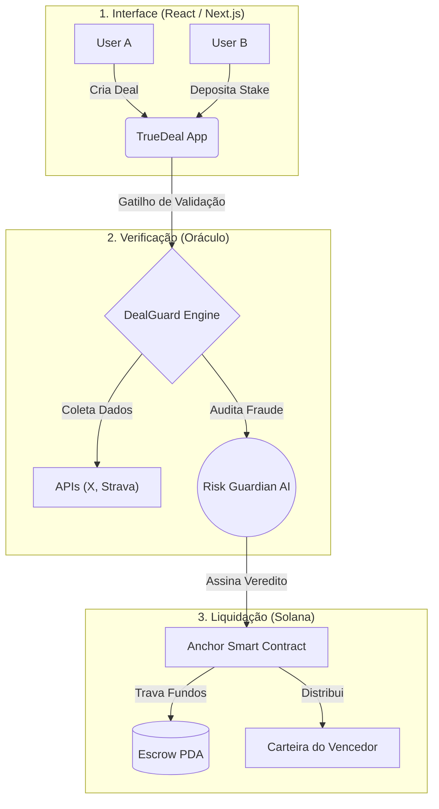

<div align="center">


# True Deal


**O app que faz o seu combinado valer de verdade.**  
*"Don't trust. Make a Deal."*

[](https://www.colosseum.org/)

[🇧🇷 Read the full Portuguese documentation below](#-versão-em-português)

</div>

---

## 🇬🇧 English Summary

### 🎯 Mission
**True Deal** is a mobile-first app that acts as an **automated digital arbitrator** for agreements between two or more people. We help you gamify personal goals with friends by turning social wagers into verifiable, on-chain contracts. No more arguments over who won—you stake real USDC, the app verifies the results automatically via APIs, and Solana distributes the pot trustlessly.

---

## 🇧🇷 Versão em Português

## 👁️ A Visão

True Deal é um aplicativo que atua como **árbitro digital automatizado** em acordos entre duas ou mais pessoas.

> **Posicionamento em uma linha:** O app que faz o seu combinado valer de verdade.

### Diferenciais
- ✅ Provas digitais verificáveis (APIs de redes sociais, saúde, GPS)
- ✅ Smart contracts (Solana) para garantir distribuição automática
- ✅ UX acessível para público não-nativo Web3, com carteiras gerenciadas (Managed Wallets)

---

## ❌ O Problema

Apostas e combinados entre pessoas dependem 100% de confiança e boa-fé. **Não existe mecanismo que:**

- ❌ Prove o estado inicial e final de forma objetiva e incontestável
- ❌ Guarde e distribua o dinheiro sem favorecer nenhuma parte
- ❌ Resolva o resultado automaticamente sem depender de julgamento humano

As soluções existentes ou são centralizadas demais, ou restritas a uma única métrica, ou voltadas exclusivamente para usuários cripto nativos — afastando o público geral.

---

## 💡 A Solução

O True Deal resolve isso transformando promessas sociais em **Infraestrutura Executável**.

### Fluxo de um Deal

| Etapa | O que acontece |
|-------|----------------|
| **01 — Criar** | Founder define: nome, tipo de deal, participantes, valor por pessoa, datas de início e fim, fator de verificação. |
| **02 — Convidar** | Participantes recebem o link e aceitam os termos do deal. |
| **03 — Pagar stake** | Todos depositam via Pix ou Cripto — fundos ficam bloqueados no Escrow On-Chain (Cofre da Solana). |
| **04 — Snapshot** | App registra o estado inicial via API (ex: contagem de seguidores no momento do início). |
| **05 — Monitorar** | Durante o período, a inteligência do app acompanha automaticamente. |
| **06 — Verificar** | Na data final, a IA (Risk Guardian) coleta dados e determina os resultados incontestáveis. |
| **07 — Distribuir** | O Smart Contract (Anchor) distribui automaticamente o "pot" para os vencedores. |

---

## 🎯 Tipos de Deal (MVP)

| Tipo | Exemplos | Fonte de verificação |
|------|----------|---------------------|
| **Redes sociais** | Quem ganha mais seguidores no X/Instagram em N dias | X API, Meta API |
| **Check-in diário** | Grupo faz check-in na academia; quem falha paga pro caixa | GPS + timestamp manual |
| **Atividade física** | Quem corre mais km em 4 semanas | Strava / Apple Health / Google Fit |
| **Meta livre** | Quem perde mais peso em 60 dias | Check-in manual com foto verificada |

### Oficial vs. Privado
- **Oficial / Plataforma:** Deals criados pelo app ou parceiros. Templates validados, APIs garantidas.
- **Privado / Grupo:** Deals criados entre amigos. Configuração livre e personalizada.

---

## 🏗️ Arquitetura Técnica & Soberana

Embora a visão seja simples e amigável para o usuário, o backend roda sob uma arquitetura de nível institucional para garantir que o dinheiro esteja seguro:



### Stack MVP

| Camada | Tecnologia |
|--------|------------|
| **Frontend** | Next.js 15 (App Router), React 19, Tailwind CSS v4 |
| **Backend / BaaS** | Supabase (DB, Auth, Edge Functions) |
| **Pagamento** | NoxPay (Pix nativo) + Solana Wallets |
| **Blockchain** | **Solana** — Anchor framework (Rust) para Smart Contracts |
| **Custódia** | Conta Gerenciada (Account Abstraction) + Escrow PDA On-Chain |

### Configuração Solana (Para Devs)

O coração on-chain do True Deal é um programa Anchor implantado na Devnet.
**Program ID:** `9zfQ1dwJ9Po7YCPWJ3S13ic3nxZcA9cEwBVsXdKub1c4`

```bash
# Build e deploy do programa
cd contracts/solana
anchor build
anchor deploy --provider.cluster devnet
```

---

## 🚀 Getting Started (Frontend)

```bash
# Clone o repositório
git clone https://github.com/lkr0102/truedeal.git
cd truedeal

# Instale dependências
pnpm install

# Configure as variáveis de ambiente
cp .env.example .env.local

# Inicie o servidor
pnpm dev
```
Acesse `http://localhost:3000`

---

## 🗺️ Roadmap

| Fase | Status | Entregas |
|------|--------|----------|
| **Fase 0 — Conceito** | ✅ Pronto | Docs, wireframes, definição de stack |
| **Fase 1 — MVP Web3** | ✅ Pronto | App funcional Next.js, Auth Supabase, Solana Escrow PDA, Multi-sig settlement |
| **Fase 2 — Integrações** | 🔄 Atual | X API, Strava, Pagamento Pix/Crypto |
| **Fase 3 — Expansão** | 📋 Futuro | SDK para terceiros, sistema de grupos, Mobile Nativo |

---

## 🏆 Colosseum Frontier Hackathon

True Deal foi desenvolvido para o **[Colosseum Frontier Hackathon](https://www.colosseum.org/)**.  
**Track:** Consumer Apps

A tese do projeto demonstra que é possível unir a experiência "Web2" (amigável, social, gamificada) com a infraestrutura inquebrável da Web3 (Smart Contracts, Liquidação automática de prêmios na Solana, Oráculos descentralizados). Nenhuma solução atual combina o ecossistema de *Sovereign Escrow* (livre de custódia humana) com *Data Oracles* e uma UX desenhada especificamente para não-nativos Web3.

---

## 👥 Founders & Core Team

**Lukas Rocha** | CEO & Product  
[@lkrcripto](https://twitter.com/lkrcripto)
- 8 anos em publicidade e comunicação estratégica
- Top 3 Arbitrum Ambassador brasileiro
- Visão de produto e comunidade.

**João (SH1W4)** | CTO & Architecture  
[GitHub /SH1W4](https://github.com/SH1W4)
- Web3 Infrastructure & Anchor Smart Contracts (Sovereign Escrow)
- DealGuard Oracle & Edge AI Integration

---

<div align="center">

Desenvolvido com ❤️ por [Lukas Rocha](https://github.com/lkr0102) & [SH1W4](https://github.com/SH1W4)  
*Don't trust. Make a Deal.*

</div>
