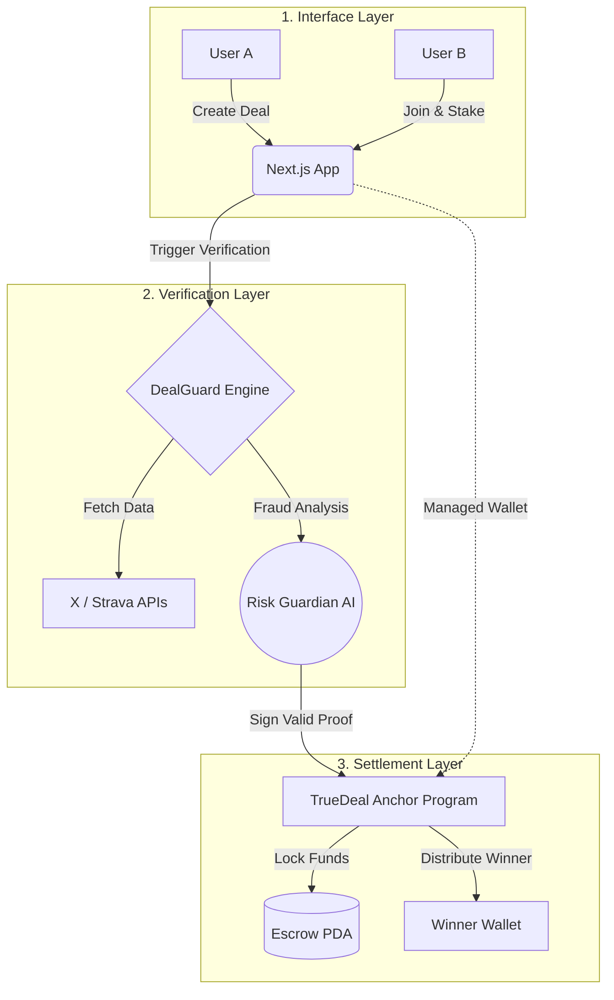

<div align="center">


# True Deal


**Gamify your personal goals and achievements with friends who share the same desires.**  
*Don"t trust. Make a True Deal.*

[](https://www.colosseum.org/)

[🇧🇷 Leia a versão em Português abaixo](#-versão-em-português)

</div>

---

## 🇬🇧 English Version

### 🎯 Mission
**True Deal** is a Sovereign Performance Agreement Protocol. We help you gamify personal goals with friends by turning social wagers into verifiable, on-chain contracts. No more arguments over who won—you stake real USDC, the app verifies the results automatically, and Solana distributes the pot trustlessly.

### ❌ The Problem
Betting on fitness goals, social growth, or daily habits with friends relies 100% on trust. 
- No objective, unforgeable proof of start and finish.
- No neutral arbiter to custody the funds.
- Someone always has to pay manually—and arguments ensue.

### 💡 The Solution
True Deal is the **Automated Digital Arbiter**:
1. **Create & Stake:** Set a goal (e.g., Strava Run or X Followers). Both friends stake $50 USDC.
2. **Snapshot:** The app logs the initial state.
3. **Verify:** The **DealGuard Oracle** continuously monitors the APIs.
4. **Settle:** Upon completion, the Rust smart contract evaluates the Oracle"s cryptographic proof and distributes the funds automatically.

---

### 🏗️ Sovereign Architecture (3-Layer Model)



### 🛠️ Tech Stack
- **Frontend:** Next.js 15 (App Router), React 19, Tailwind CSS v4, Glassmorphism UI.
- **Backend:** Supabase (Postgres, Auth).
- **Blockchain:** Solana Anchor (Rust), Escrow PDAs, Account Abstraction.
- **Verification:** DealGuard Engine (Consensus) + Risk Guardian (Local SLM AI).

### 🚀 Local Setup

```bash
git clone https://github.com/lkr0102/truedeal.git
cd truedeal
pnpm install
cp .env.example .env.local
pnpm dev
```

---

## 🇧🇷 Versão em Português

### 🎯 Missão
O **True Deal** te ajuda a gamificar suas metas e conquistas pessoais com amigos que têm os mesmos desejos que você. Chega de combinados que ficam só no papo. No True Deal, você aposta dinheiro real na sua evolução, o app verifica o resultado automaticamente, e a Solana distribui a premiação sem intermediários.

### ❌ O Problema
Apostas esportivas ou desafios entre amigos dependem 100% de confiança e boa-fé.
- Não existe prova objetiva incontestável do início e fim.
- Não existe árbitro neutro que guarde o dinheiro.
- A resolução não é automática — alguém sempre precisa pagar o outro no final.

### 💡 A Solução (Árbitro Digital Automatizado)
- **Criar & Stakar:** Defina uma meta (ex: X Followers, Strava 10km). Você e seu amigo travam o dinheiro no cofre.
- **Snapshot:** O aplicativo tira uma "foto" do seu status inicial.
- **Risk Guardian:** Um oráculo (alimentado por IA) valida as métricas finais buscando anomalias e bots.
- **Sovereign Escrow:** O programa na Solana distribui instantaneamente o pote (em USDC) para a carteira do vencedor.

### 💎 Smart Contract Details (Devnet)
- **Program ID:** `9zfQ1dwJ9Po7YCPWJ3S13ic3nxZcA9cEwBVsXdKub1c4`
- **TDP Reputation Token:** `3hwgvhV1PBj1N3vrRijqjFmJJLXM7Q2VvpdwLmWeaMbE` (1,000,000 supply)

---

## 🗺️ Roadmap

| Fase | Status | Entregas |
|------|--------|----------|
| **MVP Frontend** | ✅ Pronto | UX de criação, abstração de carteira, tracking. |
| **Blockchain** | ✅ Deployed | Escrow PDA, multi-sig settlement, Anchor Rust. |
| **Oracles** | ✅ Implementado | DealGuard (X API) + Anti-fraud fallback. |
| **Strava API** | 📋 Planejado | Integração de Km e horas de treino. |
| **Mobile App** | 📋 Fase 2 | Lançamento nativo em React Native. |
| **Edge AI Oracle** | 📋 Fase 3 | Integração do Qwen 3B para análise preditiva local. |

---

## 🏆 Colosseum Frontier Hackathon

True Deal foi desenvolvido como projeto para o **[Colosseum Frontier Hackathon](https://www.colosseum.org/)** — a principal competição de builders do ecossistema Solana. (Track: Consumer Apps).

<div align="center">

Feito com ❤️ por [Lukas Rocha](https://github.com/lkr0102) & Equipe para o ecossistema Solana.

</div>
