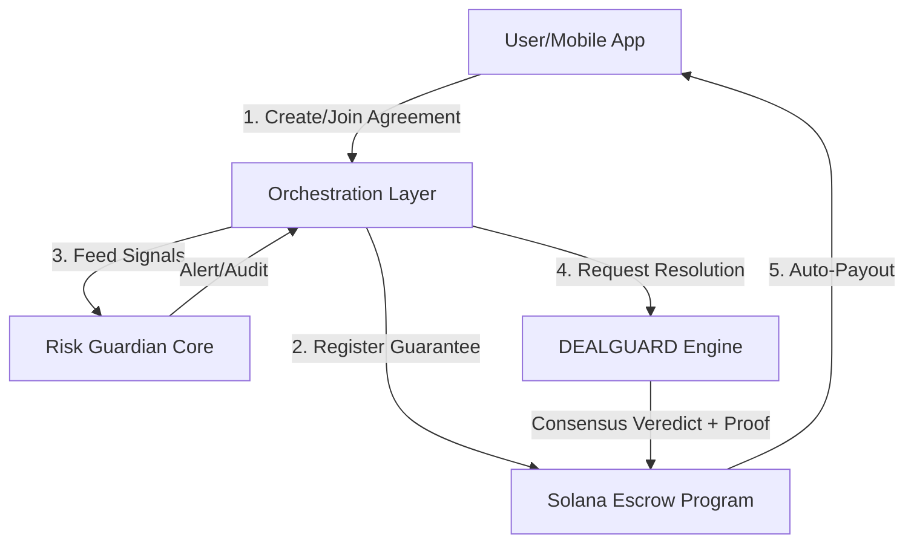

# TrueDeal Architecture

This document describes the high-level architecture of TrueDeal, an infrastructure for verifiable digital agreements on the Solana blockchain.

## 1. Overview

TrueDeal operates on a three-tier architecture that decouples user interaction from objective verification and on-chain settlement.

## 2. Components

### 2.1 Frontend (React Native / Next.js)
The primary interface for users to:
- Configure agreement parameters (Rule, Goal, Period, Guarantee).
- Connect Solana wallets (Phantom/Backpack) via **Managed Wallet** abstraction.
- Track real-time progress and receive "Risk Alerts".

### 2.2 Orchestration Layer (Supabase)
Acts as the central hub connecting off-chain data with verification engines:
- **State Management**: Keeps track of agreement lifecycles (Formation, Active, Verifying, Settled).
- **Signal Aggregator**: Ingests data from external APIs (X, Strava, Apple Health).
- **Engine Connector**: Forwards sanitized signals to the **Risk Guardian Core** and **DEALGUARD Engine**.

### 2.3 Risk Guardian Core (Proprietary Layer)
An AI-driven monitoring module that:
- Analyzes agreement creation patterns to detect potential "bad actors" or impossible goals.
- Monitors incoming signals for anomalies (e.g., bot activity on social metrics or GPS spoofing).
- Tags agreements with risk levels, triggering additional verification steps if necessary.

### 2.4 DEALGUARD Engine (Proprietary Consensus Layer)
The "Digital Jury" of the protocol. It handles the objective resolution of every agreement:
- **Consensus Protocol**: Coordinates multiple autonomous validators to verify the truth of a signal.
- **Evidence Attestation**: Generates a cryptographically signed artifact (**ValidationArtifact**) containing the result.
- **Proof Generation**: Produces the necessary hash to unlock the escrow on Solana.

### 2.5 Solana Layer (Anchor Program)
The trustless settlement layer:
- **Escrow PDAs**: Program Derived Addresses that hold guarantees securely for each agreement ID.
- **Verification Hook**: The program only releases funds when presented with a valid proof-of-resolution from the **DEALGUARD Engine**.
- **Automated Payout**: Immediate distribution of funds to the beneficiary without human intermediaries.

## 3. Data Flow

1. **Agreement Initiation**: User alocates Guarantee (SOL/USDC) -> Solana PDA locks funds.
2. **Monitoring**: Signals are fed to the **Risk Guardian Core**; anomalies are flagged.
3. **Maturity**: At the end of the agreement period, the **DEALGUARD Engine** collects all evidence.
4. **Resolution**: Engine reaches consensus -> proof is submitted to Solana.
5. **Settlement**: Solana program verifies the proof and executes the payout.
