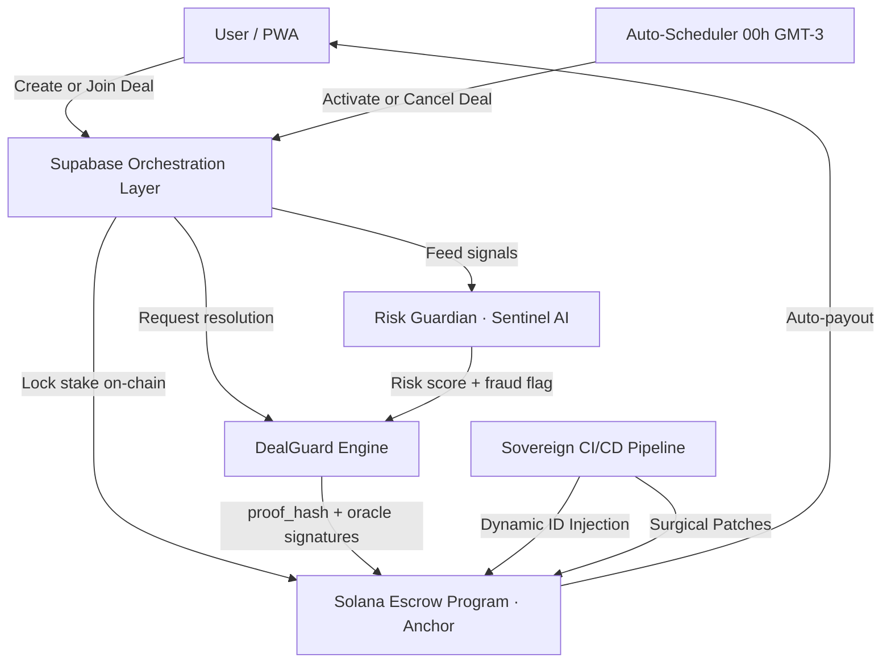

# TrueDeal — System Architecture

This document describes the high-level architecture of TrueDeal: an infrastructure for verifiable, self-executing digital performance agreements on the Solana blockchain.

---

## 1. Overview

TrueDeal operates on a four-tier architecture that decouples user interaction, off-chain orchestration, automated verification, and trustless on-chain settlement.



---

## 2. Components

### 2.1 Frontend (Next.js 15 — PWA)
The primary interface for users to:
- Configure deal parameters (rule, goal, frequency, period, stake, verification channels).
- Track real-time compliance progress and deal status.
- Join deals, view results, and manage their managed wallet.
- No browser extension or Web3 knowledge required.

### 2.2 Auto-Scheduler
A server-side job that runs daily at **00:00 GMT-3** and evaluates all deals whose `start_date` matches the current date and whose status is `formacao`:

- **≥ 2 participants confirmed** → deal transitions to `ativo`; Shakes are credited; `start_snapshot` is recorded.
- **< 2 participants** → deal transitions to `cancelado`; stakes are fully refunded.

### 2.3 Supabase Orchestration Layer
Acts as the central hub connecting off-chain data with verification engines:
- **State Management**: Tracks agreement lifecycle.
- **Signal Aggregator**: Ingests data from external APIs.
- **Compliance Engine Connector**: Forwards sanitized signals to Risk Guardian and DealGuard.

### 2.4 Risk Guardian (Sentinel AI)
An AI-driven monitoring module that detects anomalies (bot activity, GPS spoofing, duplicate content) and returns a `risk_score`.

### 2.5 DealGuard Engine (Consensus Layer)
The "digital jury" of the protocol. It orchestrates objective resolution, generates a **SHA-256 forensic proof hash**, and coordinates **dual-oracle multi-sig** settlement.

### 2.6 Solana Layer (Anchor Program)
The trustless settlement layer:
- **Escrow PDAs**: `[b"deal", deal_id]` — deterministic vaults.
- **`settle_performance_agreement`**: Releases funds only when both oracle keypairs sign and a valid `proof_hash` is attached.
- **Dynamic ID Management**: The program ID is managed by the Sovereign Pipeline, ensuring no authority conflicts during automated deploys.

### 2.7 Account Abstraction (Managed Wallets)
Each user receives an automatically provisioned Solana wallet, encrypted with AES-256-GCM. The backend signs all transactions on behalf of the user.

### 2.8 Sovereign Build & Deploy Pipeline
A specialized infrastructure to maintain build stability in legacy Solana environments:
- **Surgical Patching**: Manual overrides in the `vendor/` directory to neutralize incompatible dependencies (Edition 2024, unstable Rust features).
- **Autonomous Deployment**: The CI/CD generates a fresh keypair per deployment, extracts the ID, and injects it into the source code (`lib.rs`) and configuration (`Anchor.toml`) via `sed` before building.
- **Artifact Persistence**: Compiled binaries (`.so`) and IDLs are automatically uploaded as GitHub artifacts regardless of deployment funding status.

---

## 3. Deal State Machine

```
formacao → ativo → liquidando → encerrado
        ↘ cancelado
```

---

## 4. Compliance Evaluation Flow

1. Fetch API data.
2. Apply sub-rules.
3. Count valid events in window.
4. Mark as LOSER if `valid_count < minimum` or if Sentinel AI detects fraud.
5. Generate `proof_hash` and submit multi-sig settlement to Solana.

---

## 5. Execution Modes

| Condition                             | Mode       | Behavior                                    |
|:--------------------------------------|:-----------|:--------------------------------------------|
| Oracle keys missing in `.env`         | Demo       | Settlement simulated; DB updated normally   |
| Placeholder Supabase URL              | Demo       | Same as above                               |
| Both oracle keys + real Supabase URL  | Production | Real Anchor instruction on Solana Devnet    |

**Infrastructure Stability Rule:** *NEVER run `cargo update` or `cargo vendor` without re-applying the stability scripts (`zero_checksums.py`). The local vendor source is the ONLY source of truth for the SBF compiler.*

---
**TrueDeal Protocol - Code is Law. Integrity is Sovereignty.**
