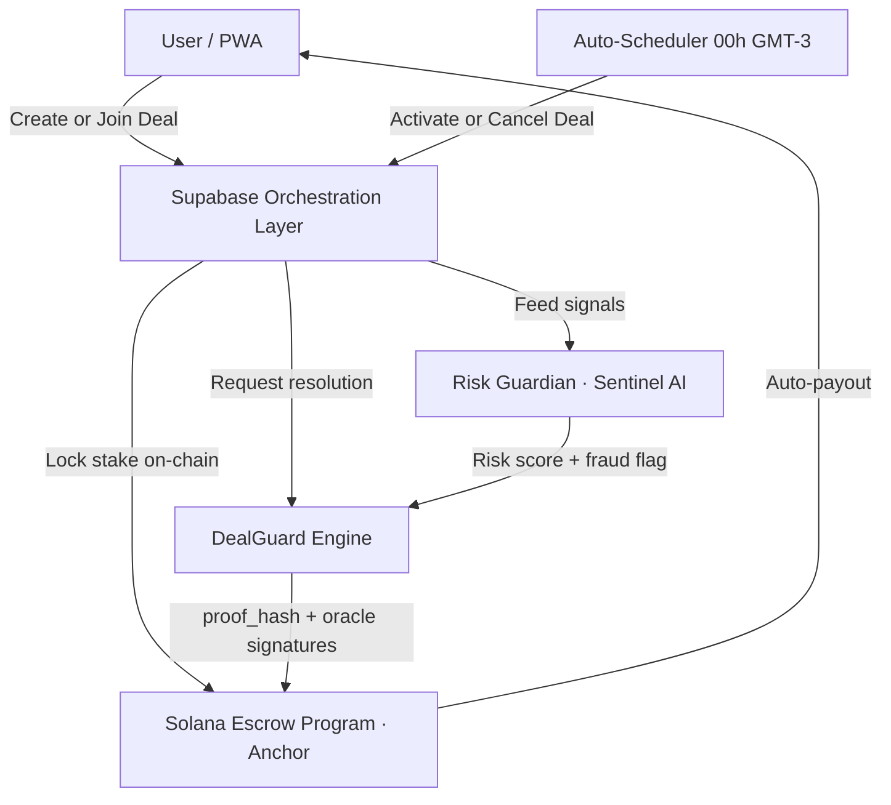

# TrueDeal — System Architecture

This document describes the high-level architecture of TrueDeal: an infrastructure for verifiable, self-executing digital performance agreements on the Solana blockchain.

---

## 1. Overview

TrueDeal operates on a four-tier architecture that decouples user interaction, off-chain orchestration, automated verification, and trustless on-chain settlement.



---

## 2. Components

### 2.1 Frontend (Next.js 15 — PWA)
The primary interface for users to:
- Configure deal parameters (rule, goal, frequency, period, stake, verification channels).
- Track real-time compliance progress and deal status.
- Join deals, view results, and manage their managed wallet.
- No browser extension or Web3 knowledge required.

### 2.2 Auto-Scheduler
A server-side job that runs daily at **00:00 GMT-3** and evaluates all deals whose `start_date` matches the current date and whose status is `formacao`:

- **≥ 2 participants confirmed** → deal transitions to `ativo`; Shakes are credited (500 for creator, 200 per participant); `start_snapshot` is recorded for all participants.
- **< 2 participants** → deal transitions to `cancelado`; stakes are fully refunded; no Shakes credited.

### 2.3 Supabase Orchestration Layer
Acts as the central hub connecting off-chain data with verification engines:
- **State Management**: Tracks agreement lifecycle (`formacao → ativo → liquidando → encerrado / cancelado`).
- **Signal Aggregator**: Ingests data from external APIs (X, Strava, Wellhub, TotalPass).
- **Compliance Engine Connector**: Forwards sanitized signals to Risk Guardian and DealGuard for window-by-window evaluation.

### 2.4 Risk Guardian (Sentinel AI)
An AI-driven monitoring module that:
- Analyzes each participant's evidence per compliance window.
- Detects anomalies: bot activity on social metrics, GPS spoofing on Strava, duplicate post content.
- Returns `risk_score` and `isFraudulent` per participant per audit cycle.
- Fraudulent participants are marked as losers regardless of raw metric values.

### 2.5 DealGuard Engine (Consensus Layer)
The "digital jury" of the protocol. It orchestrates objective resolution at deal end:
- Collects evidence for every participant across all verification channels.
- Evaluates compliance per frequency window — any window below the configured minimum = loser.
- Generates a **SHA-256 forensic proof hash** (`proof_hash`) attesting to the audit results.
- Coordinates **dual-oracle multi-sig** (Oracle 1 + Oracle 2) to authorize on-chain settlement.

### 2.6 Solana Layer (Anchor Program)
The trustless settlement layer:
- **Escrow PDAs**: `[b"deal", deal_id]` — deterministic vaults holding stakes. No private key controls them.
- **`join_agreement`**: Transfers custody from participant wallet to PDA. Exact amount enforced on-chain.
- **`settle_performance_agreement`**: Releases funds only when both oracle keypairs sign and a valid `proof_hash` is attached. Fails with `AgreementError::InvalidStatus` if deal is not `ativo`.

### 2.7 Account Abstraction (Managed Wallets)
Each user receives an automatically provisioned Solana wallet on signup, encrypted with AES-256-GCM and stored in Supabase (`user_wallets.encrypted_secret`). The backend signs all transactions on behalf of the user — no browser extension required for MVP.

---

## 3. Deal State Machine

```
formacao → ativo → liquidando → encerrado
        ↘ cancelado
```

| State        | Trigger                                                         |
|:-------------|:----------------------------------------------------------------|
| `formacao`   | Deal creation (automatic)                                       |
| `ativo`      | Scheduler at 00:00 GMT-3 on `start_date`, with ≥ 2 participants|
| `cancelado`  | Scheduler at 00:00 GMT-3 on `start_date`, with < 2 participants |
| `liquidando` | DealGuard Engine begins audit at `end_date`                     |
| `encerrado`  | On-chain settlement confirmed                                   |

---

## 4. Compliance Evaluation Flow

```
For each frequency window in the deal period:
  For each participant:
    1. Fetch API data (Strava activities, X posts, etc.)
    2. Apply sub-rules (public account, >100 chars, unique content, etc.)
    3. Count valid events in window
    4. IF valid_count < configured_minimum → mark as LOSER (final)
    5. Run Sentinel AI fraud check → if fraudulent → mark as LOSER (final)

At end of period:
  Participants not marked as LOSER → WINNER
  Generate proof_hash over all results
  Submit multi-sig settlement to Solana
```

---

## 5. Execution Modes

| Condition                             | Mode       | Behavior                                    |
|:--------------------------------------|:-----------|:--------------------------------------------|
| Oracle keys missing in `.env`         | Demo       | Settlement simulated; DB updated normally   |
| Placeholder Supabase URL              | Demo       | Same as above                               |
| Both oracle keys + real Supabase URL  | Production | Real Anchor instruction on Solana Devnet    |

Demo Mode is designed to be fully transparent to end users — all UX flows, status transitions, and Shakes work identically.
