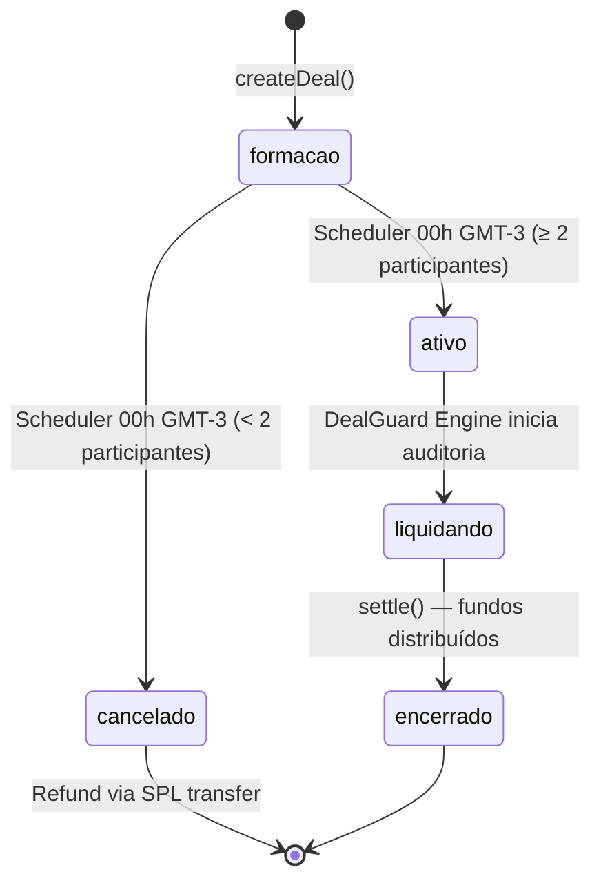

# On-Chain Logic & State Machine — TrueDeal

> **Última atualização:** 2026-05-19 — Anchor program deprecated; fluxo atual usa SPL transfers diretos. State machine de negócio permanece igual.

---

## 1. Estado Atual da Arquitetura On-Chain

> **Decisão arquitetural (2026-05-19):** O Anchor Program foi substituído por **transferências SPL Token diretas** entre managed wallets. O fluxo financeiro acontece via `@solana/spl-token` (sem PDAs Anchor). O estado do deal é gerenciado no Supabase.

**O que mudou:**
- Antes: `initPerformanceAgreement` + PDA vault + `joinAgreement` + `settlePerformanceAgreement`
- Agora: SPL transfer direto `user ATA → fee payer ATA` no join; SPL transfer `fee payer ATA → winner ATAs` no settle

**O que permanece:**
- State machine de negócio (formacao → ativo → liquidando → encerrado)
- Lógica econômica (Slacker Tax 3%)
- Provas criptográficas (SHA-256 proof hash)
- Multi-oracle consensus (lógica off-chain via DealGuard)

---

## 2. Máquina de Estados do Acordo



### Detalhes dos Estados

| Estado | Descrição | Transição |
|:-------|:----------|:----------|
| `formacao` | Aceita participantes; stake coletado via SPL transfer | Scheduler automático |
| `ativo` | Período de performance em curso | DealGuard Engine |
| `cancelado` | Quórum não atingido; refund total via SPL | Automático |
| `liquidando` | Auditoria em execução; fundos retidos | DealGuard → settle |
| `encerrado` | Payout executado; protocolo encerrado | Final |

---

## 3. Regras de Compliance por Janela (Strict Window Model)

O DealGuard Engine avalia cumprimento de forma **estrita por janela de frequência**:

```
Para cada janela de frequência no período do deal:
  SE cumprimento_da_janela < quantidade_configurada:
    → participante = PERDEDOR (irreversível naquela janela)
```

Uma janela perdida = eliminado, independente de outras janelas.

### Sub-regras por Tipo de Verificação

| `verification_type` | Canal | Sub-regras de validade |
|:--------------------|:------|:-----------------------|
| `post_feito` | X | Conta pública; post > 100 chars; conteúdo único no período |
| `seguidores_recebidos` | X, Instagram, TikTok, LinkedIn, YouTube | Delta líquido por janela (ganhos − perdas) ≥ N |
| `impressoes` | X, Instagram, TikTok, LinkedIn, YouTube | Total de impressões na janela ≥ N |
| `reposts_recebidos` | X, Instagram, TikTok | Total de reposts na janela ≥ N |
| `comentarios` | X, Instagram, TikTok, LinkedIn, YouTube | Total de comentários recebidos na janela ≥ N |
| `km_corridos` | Strava | Soma de atividades `Run` na janela ≥ N km |
| `horas_exercicio` | Strava | Tempo total de atividades na janela ≥ N horas |
| `checkins` | Strava, Wellhub, TotalPass | Número de check-ins registrados na janela ≥ N |
| `ambientes_diferentes` | Strava, Wellhub, TotalPass | Locais distintos visitados na janela ≥ N |
| `pace` | Strava | Pace médio das corridas ≤ pace configurado (min/km) |

> **Dados insuficientes**: se o DealGuard não conseguir coletar dados (token expirado, API offline, conta privada), o participante é tratado como não-cumprimento.

---

## 4. Lógica de Liquidação (Slacker Tax)

```
slacker_pool      = n_perdedores × entry_amount
platform_fee      = slacker_pool × 0.03
reward_per_winner = (slacker_pool − platform_fee) / n_vencedores
payout_winner     = entry_amount + reward_per_winner
```

**Implementação atual (SPL direto):**
```typescript
// lib/actions/settlement.ts — settleDealProtocol()
// 1. Calcula vencedores via DealGuard
// 2. SPL transfer de entry_amount de volta para cada vencedor
// 3. SPL transfer de reward_per_winner para cada vencedor
// 4. 3% fica retido na protocol wallet (treasury)
```

---

## 5. Segurança e Integridade

### Provas Criptográficas
- **Rule Hash**: SHA-256 das regras capturado no `createDeal`
- **Proof Hash**: SHA-256 do relatório forense gerado pelo DealGuard no `settle`
- Qualquer pessoa pode verificar off-chain se os dados batem com o hash registrado

### Multi-Oracle (Off-Chain)
O DealGuard Engine requer consenso de dois oráculos (`oracle_1` e `oracle_2`) antes de executar qualquer liquidação. Ambas as chaves devem assinar a transação SPL de settle.

### Managed Wallets
Keypairs de usuário são gerados server-side, encriptados com AES-256 e armazenados no Supabase. Nunca expostos ao browser.

---

## 6. Endereços de Referência (Devnet)

| Recurso | Endereço |
|:--------|:---------|
| Anchor Program (legacy, não em uso) | `HdMnEf5jc3q6tws2vYLZgFgwFWKkKpNaK5CRKnF3a7mp` |
| USDC Mint (devnet) | `BpXHCSnxhbzSjzWeaTHG14g1zETtcZeDGk772Nvwjb99` |
| USDC Mint (mainnet) | `EPjFWdd5AufqSSqeM2qN1xzybapC8G4wEGGkZwyTDt1v` |
| Oracle 1 / Fee Payer | Derivado de `APP_FEE_PAYER_KEY` |
| Oracle 2 | Derivado de `ORACLE_2_PRIVATE_KEY` |
