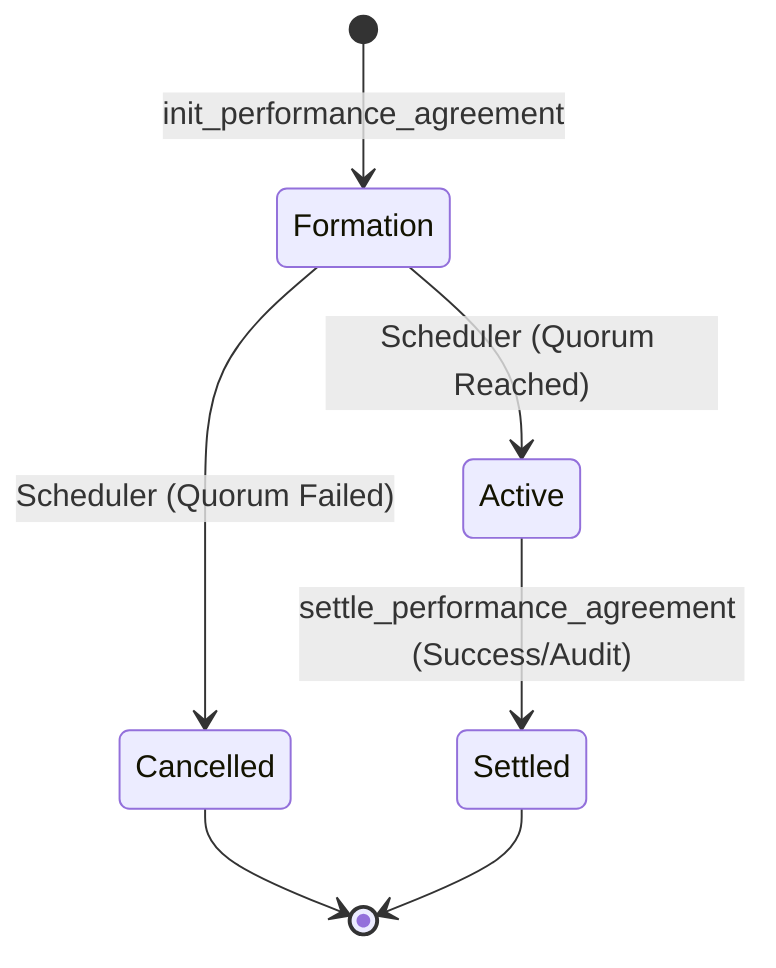

# 🤖 On-Chain Logic: Contract State Machine

Este documento detalha o fluxo lógico e financeiro do Smart Contract TrueDeal na Solana, servindo de base para auditorias técnicas e integrações de backend.

---

## 1. Fluxo de Vida do Acordo (State Machine)

### Detalhes dos Estados:
- **Formation**: O contrato aceita `join_agreement`. Os fundos ficam travados no PDA.
- **Active**: O período de performance começou. Nenhum novo participante pode entrar.
- **Settled**: A auditoria foi concluída. O Slacker Tax foi retido e os prêmios distribuídos.
- **Cancelled**: Fundos devolvidos integralmente aos participantes.

---

## 2. Lógica de Liquidação e Slacker Tax

A liquidação é o momento onde a "Lei do Código" é aplicada.

### Algoritmo de Distribuição:
1. **Identificação**: O DealGuard fornece o `winners_count`.
2. **Cálculo do Slacker Pool**:
   `slacker_pool = (total_participants - winners_count) * guarantee_amount`
3. **Taxa de Sustentabilidade (3%)**:
   `platform_fee = slacker_pool * 0.03`
4. **Prêmio Líquido**:
   `reward_per_winner = (slacker_pool - platform_fee) / winners_count`
5. **Payout Final**:
   `total_payout = guarantee_amount + reward_per_winner`

---

## 3. Segurança e Consenso (DealGuard)

O contrato implementa uma camada de **Consenso Off-Chain para Execução On-Chain**.

### Multi-Sig de Oráculos:
Para que a função `settle_performance_agreement` execute, o contrato verifica:
- `require!(ctx.accounts.oracle_1.is_signer && ctx.accounts.oracle_2.is_signer)`
Isso garante que mesmo que uma chave de oráculo seja comprometida, o hacker não consegue liquidar o contrato sozinho.

### Integridade dos Dados (Hashing):
- **Rule Hash**: Hash SHA-256 das regras (Markdown/PDF) capturado no `init`.
- **Proof Hash**: Hash SHA-256 do relatório forense da auditoria capturado no `settle`.
Qualquer pessoa pode validar off-chain se os dados da auditoria batem com o que foi registrado no contrato.

---

## 4. Estrutura de Contas (PDAs)

O TrueDeal utiliza Program Derived Addresses para máxima segurança:
- **Agreement Account**: `seeds = [b"agreement", agreement_id]`
- **Vault Account**: A conta de token (SPL Token) que pertence ao PDA do acordo.

---
**"A confiança não é dada ao código; ela é extraída através de provas matemáticas de integridade."** 🖖
